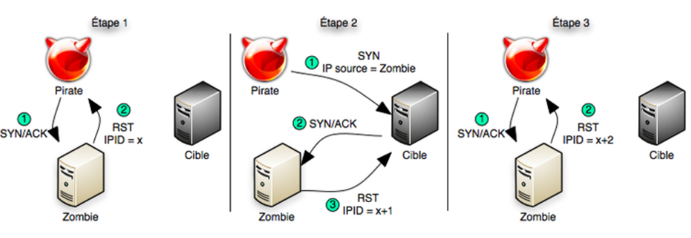

NMAP
====

**Source** : https://k-lfa.info/nmap/

Examples
--------

*Nmap est un outil de scan assez complet il dispose de nombreux arguments et de nombreuse méthode d'utilisation :*

**-sL** : liste simplement les cibles à scanner

**-sP** : ne fait que déterminer si les hôtes sont en ligne‌‌

**-Pn**: considérer tous les hôtes comme étant connectés (pas de ping)‌‌

**-Ps** **-Pa** **-Pu** : découverte TCP SYN ou ACK ou UDP des ports en paramètre

**-Pe** **-Pp** **-Pm** : découverte de type requête ICMP echo, timestamp ou netmask‌‌

**-Po** [num de protocole] : Ping IP (par type)‌‌

**-n/-R** : *ne pas résoudre les noms DNS/toujours résoudre les cibles actives par défaut‌‌--dns-servers serv1,serv2,... : spécifier des serveurs DNS particuliers‌‌*

**-P0** : considère que tous les hôtes sont en ligne (évite la découverte des hôtes)‌‌

**--open** : n'affiche que les ports ouverts

**-sU** : Ne scan que le protocol UDP

**-sT** : ne scan que le protocol TCP (par défaut)

Doc des techniques de scanning : https://nmap.org/man/fr/man-port-scanning-techniques.html

.. code-block:: bash
  :linenos:
  
  nmap 192.168.239.128 -sT -sU --open
  #Scan les ports TCP/UDP sur l'adresse IP 192.16/8.239.128 et n'affiche que les ports ouverts

  nmap 192.168.239.128 -p 1-445 -sT -sU -Pn
  #Scan les ports TCP/UDP 1 à 445 sur l'adresse IP 192.16/8.239.128 sans ping (Plus rapide)

  nmap 192.168.239.0/24 -Pn -p 22 
  #Scan le port 22 de tout le réseau 192.168.239.0/24

  nmap -sP 192.168.239.0/24
  #Vérifie les hôtes en ligne sur la plage 192.168.239.0/24

Spécifications des ports et ordre de scan
------------------------------------------

**-p 1-1024** : ne scanne que les ports spécifiés (exemple 1 à 1024)‌‌

**-F** : ne scanne que les ports listés dans le fichier /usr/share/nmap/nmap-services‌‌

**-r** : scan séquentiel des ports, ne mélange pas leur ordre‌‌

**--top-ports nombre** : scan  de ports parmi les plus courants

**--port-ratio ratio** : scan  pourcentage des ports les plus courants

.. code-block:: bash
  :linenos:
  
  nmap -r -p 1-1024 192.168.239.129 
  #Scan dans le désordre les ports 1 à 1024 de l'adresse 192.168.239.129  

  nmap -p 1-1024 192.168.239.129 --top-ports 10 
  #Scan les ports 1 à 1024 et affiche les 10 ports les plus utilisés   

  21/tcp  open ftp 
  22/tcp  open ssh 
  23/tcp  open telnet
  25/tcp  open smtp 
  80/tcp  open http 
  110/tcp closed pop3 
  139/tcp open netbios-ssn 
  143/tcp closed imap 
  443/tcp closed https 
  445/tcp open   microsoft-ds
  

Détection de service/version
----------------------------
 
**-sV** : teste les ports ouverts pour déterminer le service en écoute et sa version   ‌‌

**--version-light** : limite les tests aux plus probables pour une identification plus rapide‌‌

**--version-intensity niveau** : de 0 (léger) à 9 (tout essayer)

**--version-all** : essaie un à un tous les tests possibles pour la détection des versions‌‌

**--version-trace** : affiche des informations détaillées du scan de versions (pour débogage)

.. code-block:: bash
  :linenos:

  nmap -p 21-445 192.168.239.129 --version-all -sV 
  #Scan les ports 21 à 445 et determine la version des services en faisant tous les tests possibles
  21/tcp  open  ftp vsftpd 2.3.4 
  22/tcp  open  ssh OpenSSH 4.7p1 Debian 8ubuntu1 (protocol 2.0) 
  23/tcp  open  telnet  Linux telnetd 
  25/tcp  open  smtpPostfix smtpd 
  53/tcp  open  domain  ISC BIND 9.4.2 
  80/tcp  open  httpApache httpd 2.2.8 ((Ubuntu) DAV/2) 
  111/tcp open  rpcbind 2 (RPC #100000) 
  139/tcp open  netbios-ssn Samba smbd 3.X - 4.X (workgroup: WORKGROUP) 
  445/tcp open  netbios-ssn Samba smbd 3.X - 4.X (workgroup: WORKGROUP)
  
Détection de système d’exploitation
-----------------------------------

**-O** : active la détection d’OS‌‌

**--osscan-limit** : limite la détection aux cibles prometteuses‌‌

**--osscan-guess** : détecte l’OS de façon plus agressive

.. code-block:: bash
  :linenos:

  nmap 192.168.239.129 -O --osscan-guess 
  #Découverte de l'OS de l'hôte en mode agressif  

  Running: Linux 2.6.X OS 
  CPE: cpe:/o:linux:linux_kernel:2.6 
  OS details: Linux 2.6.9 - 2.6.33
  
Lors d'un scan de nombreux paquets sont envoyés sur le réseau, si les scans sont agréssifs ou en mode rush, vous serez grillés !

Pare-feu et usurpation d’identité
---------------------------------

**-f;--mtu valeur** : fragmente les paquets (en spécifiant éventuellement la MTU)‌‌

**-D IP1,IP2,...** : obscurcit le scan avec des leurres‌‌

**-sI IP_zombie** : Idle scan, utilise une machine dite zombie pour scanner la cible‌‌-S IP : usurpe l’adresse source‌‌-e iface : utilise l’interface réseau spécifiée‌‌

**-g --source-port port** : utilise le numéro de port comme source‌‌

**--data-length num** : ajoute des données au hasard aux paquets émis‌‌

**--ip-options options** : envoie des paquets avec les options IP spécifiées‌‌

**--ttl val** : spécifie le champ time-to-live IP  ‌‌

**--spoof-mac MAC**  : usurpe une adresse MAC‌‌

**--badsum** : envoie des paquets TCP/UDP avec une somme de contrôle erronée.

**-sS** : Scan half-open (stealth) méthode discrète

**-T <Paranoid|Sneaky|Polite|Normal|Aggressive|Insane>‌** : Mode de scan avec des paramètres prédéfinies (du plus discret/lent au plus rapide/moins discret)

**-T0 -> -T4** : Template de scan (du plus discret/lent au plus agressif/rapide)

.. code-block:: bash
  :linenos:

  nmap -D 10.10.10.1,10.10.10.2,10.10.10.3 192.168.239.129 
  #Envois des requêtes de scan avec en plus les IP sources 10.10.10.1 10.10.10.2 10.10.10.3  

  nmap -S 192.168.239.130  192.168.239.129 -e eth0 -p 22 
  #Scan le port 22 de l'adresse 192.168.239.129 en spoofant l'adresse 192.168.239.130  

  nmap 192.168.239.129 --spoof-mac 00:0c:29:9a:54:7e  
  #Spoof l'adresse mac 00:0c:29:9a:54:7e pour les requêtes

  nmap -sI 192.168.1.19 192.168.239.129 -p 22 -sV --version-all
  #Idle scan depuis l'hôte 192.168.1.19 sur le port 22
  
La commande nmap permet aussi de jouer avec le format des données en sortie, soit par type de donnée, soit en l’envoyant dans un fichier :

Format de Sortie
----------------

**-oN** : sortie dans le fichier en mode normal‌‌

**-oX** : sortie dans le fichier en XML‌‌

**-oG** : sortie dans le fichier en paramètre au format grepable‌‌

**-oA** basename : sortie dans les trois formats majeurs en même temps‌‌

**-v** : rend nmap plus verbeux (-vv pour plus d’effet)‌‌

**-d [level]** : sélectionne ou augmente le niveau de débogage (significatif jusqu’à 9)‌‌

**--packet-trace** : affiche tous les paquets émis et reçus‌‌

**--iflist** : affiche les interfaces et les routes de l’hôte (pour débogage)

**--log-errors** : journalise les erreurs/alertes dans un fichier au format normal‌‌

**--append-output**: ajoute la sortie au fichier plutôt que de l’écraser

**--resume filename** : reprend un scan interrompu‌‌

**--stylesheet path/URL** : feuille de styles XSL pour transformer la sortie XML en HTML‌‌

**--webxml** : feuille de styles de références de Insecure.Org pour un XML plus portable‌‌

**--no_stylesheet** : nmap n’associe pas la feuille de styles XSL à la sortie XML

.. code-block:: bash
  :linenos:

  nmap 192.168.239.129 -p 21-445 -oN /tmp/scan21_445.txt 
  #Scan les ports 21 à 445 en écrivant le résultat dans /tmp/scan21_445.txt (ecrase le fichier si existant)  
  
  nmap 192.168.239.129 -p 446-1024 --append-output /tmp/scan21_445.txt 
  #Scan les ports 446-1024 et ajoute le résultat dans /tmp/scan21_445.txt (sans l'écraser)  
  
  nmap 192.168.239.129 -p 446-1024 -oG /tmp/test.txt && cat /tmp/scan.txt  
  Host: 192.168.239.129 ()	Status: Up 
  Host: 192.168.239.129 ()	Ports: 512/open/tcp//exec///, 513/open/tcp//login///, 514/open/tcp//shell///	Ignored State: closed (576)

L'avantage de nmap c'est qu'il est aussi capable de faire office de "scanner de vulnérabilité" puisqu'il embarque des scrips applicable sur un hôte/réseau pour voir ci celui-ci possède une CVE sur un de ses services.

Scripts‌‌ de vulnerabilités
--------------------------------------------------

*Liste des scripts dans /usr/share/nmap/scripts/*

**-sC** : équivalent de --script=safe,intrusive‌‌

**--script=lua scripts** :   est une liste de répertoires séparés par des virgules‌‌

**--script-args=<n1=v1,[n2=v2,...]>** : passer des arguments aux scripts‌‌

**--script-trace** : montre toutes les données envoyées ou reçues‌‌
(Utile pour le debug)

**--script-updatedb** : met à jour la base de données des scripts. Seulement fait si l’option -sC ou --script a été aussi indiquée

Doc des types de scripts https://nmap.org/book/nse-usage.html#nse-usage

.. code-block:: bash
  :linenos:

  nmap -p 21 --script ftp-vsftpd-backdoor.nse 192.168.239.129
  
  PORT     STATE SERVICE
  21/tcp   open  ftp
  | ftp-vsftpd-backdoor: 
  |   VULNERABLE:
  |   vsFTPd version 2.3.4 backdoor
  |     State: VULNERABLE (Exploitable)
  |     IDs:  CVE:CVE-2011-2523  OSVDB:73573
  |       vsFTPd version 2.3.4 backdoor, this was reported on 2011-07-04.
  |     Disclosure date: 2011-07-03
  |     Exploit results:
  |       Shell command: id
  |       Results: uid=0(root) gid=0(root)
  
  #Vulnerabilité compatible avec la version du service vsftpd
  
  
  nmap 192.168.239.129 --script discovery
  
  broadcast-igmp-discovery: 
  |   192.168.239.1
  |     Interface: eth0
  
  22/tcp   open  ssh
  |_banner: SSH-2.0-OpenSSH_4.7p1 Debian-8ubuntu1
  | ssh-hostkey: 
  |   1024 60:0f:cf:e1:c0:5f:6a:74:d6:90:24:fa:c4:d5:6c:cd (DSA)
  |_  2048 56:56:24:0f:21:1d:de:a7:2b:ae:61:b1:24:3d:e8:f3 (RSA)
  
  25/tcp   open  smtp
  |_banner: 220 metasploitable.localdomain ESMTP Postfix (Ubuntu)
  
  80/tcp   open  http
  |_http-apache-negotiation: mod_negotiation enabled.
  | http-auth-finder: 
  Spidering limited to: maxdepth=3; maxpagecount=20; withinhost=192.168.239.129
  |   url                                                               method
  |   http://192.168.239.129/phpMyAdmin/                                FORM
  |   http://192.168.239.129/mutillidae/./index.php?page=login.php      FORM
  |_  http://192.168.239.129/mutillidae/./index.php?page=user-info.php  FORM
  http-default-accounts: 
  |   [Apache Tomcat] at /manager/html/
  |_    tomcat:tomcat
  | http-enum: 
  |   /admin/: Possible admin folder
  |   /admin/index.html: Possible admin folder
  |   /admin/login.html: Possible admin folder
  |   /admin/admin.html: Possible admin folder
  .....
  
  #Utilise les script de découvertes (services, configurations ...)

Quelques exemples concrets :

.. code-block:: bash
  :linenos:

  nmap 192.168.239.129 -sT -sU -Pn -O -p 1-2100,8080 -sV --version-all --open
  #Scan, sans ping de l'hôte, les ports TCP/UDP 1 à 2100 et 8080 en affichant la version des services (all) ainsi que la version de l'OS et n'affiche que les ports ouverts 
  
  nmap 192.168.239.129 -r -p 1-445 -sV --version-light -sI 192.168.239.120 -Pn
  #Scan des ports 1 à 445 dans le désordre en donnant la version (light + rapide) en Idle scan depuis 192.168.239.120 sans ping 
  
  nmap 192.168.1.0/24 -p 80 -sV --version-light -oG WEB_NET.txt
  #Scan les services web de la plage réseau 192.168.1.0/24 et redirige dans un fichier grepable WEB_NET.txt
  
  nmap 192.168.239.129 -Pn -sT -p 22,80,445,443
  #Scan rapide des ports 22,80,443,445

Flags TCP
---------

**SYN**: Initie la connexion entre 2 hôtes

**ACK** : Approuve la réception d'un paquet (Accusé de réception)

**RST** : Réinitialise la connexion

**FIN** : Annonce la fin des transmissions

**PSH** : Force l'envoi des données de tampon

**URG** : Les données du paquet doivent être traités en urgence

Scan TCP Ouvert / Furtif
------------------------

**Full Open Scan (TCP Connect) :** 

*Établie une connexion complète sur le port de la cible*

**Half-Open Scan (Stealth)**

*Initie la connexion TCP puis interrompt la connexion
L'attaquant initie la connexion TCP (SYN) si la cible répond (ACK/SYN), l'attaquant reset la connexion (RST)*

Scan TCP Furtif
---------------

**Null Scan**

*Envoi d'un paquet "Sonde" (probe packet) sans flag*

**Xmas Scan : Envoi d'une trame TCP (Flags URG/PSH/FIN)**

**Scan Idle (Zombie)**

*Permet d'usurper l'adresse IP d'un hôte (Si IPID +1 alors le port est fermé)*